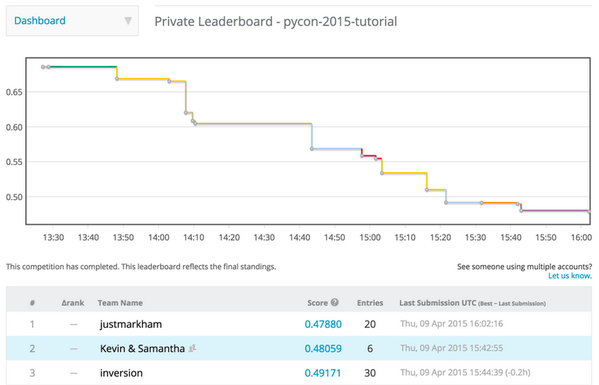

# Kaggle's PyCon 2015 competition

At [PyCon 2015](https://us.pycon.org/2015/), Kaggle hosted a small competition during their tutorial: [Winning Machine Learning Competitions with scikit-learn](https://us.pycon.org/2015/schedule/presentation/321/). There were 28 teams, and we had less than three hours to work on the problem. This repo contains the [code](kaggle.py) from my first place submission.

Links:

- [Tutorial repo](https://github.com/dchudz/pycon2015-kaggle-tutorial)
- [Competition page](https://inclass.kaggle.com/c/pycon-2015-tutorial)
- [Data files](https://inclass.kaggle.com/c/pycon-2015-tutorial/data)
- [Final leaderboard](https://inclass.kaggle.com/c/pycon-2015-tutorial/leaderboard)

Feel free to [contact me](http://www.dataschool.io/about/) with any questions! If you'd like to learn how to use scikit-learn for machine learning, I have a new [series of video tutorials](http://blog.kaggle.com/author/kevin-markham/) covering that topic that are hosted on Kaggle's blog.
